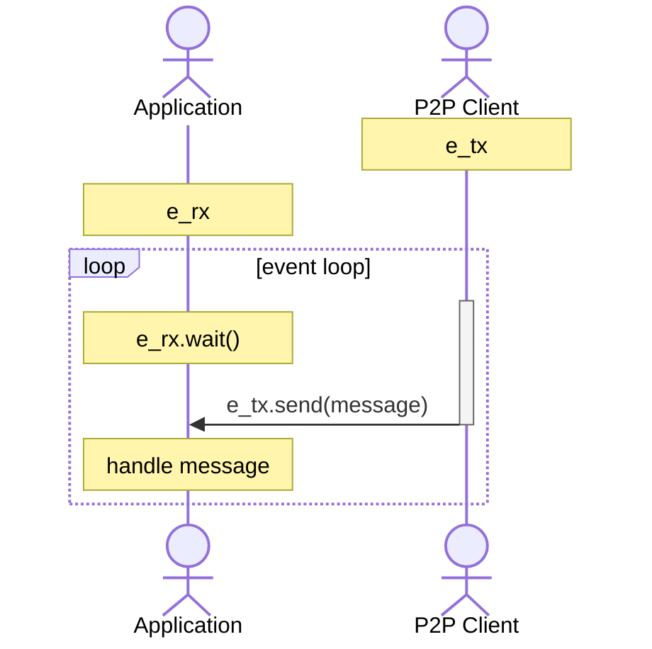
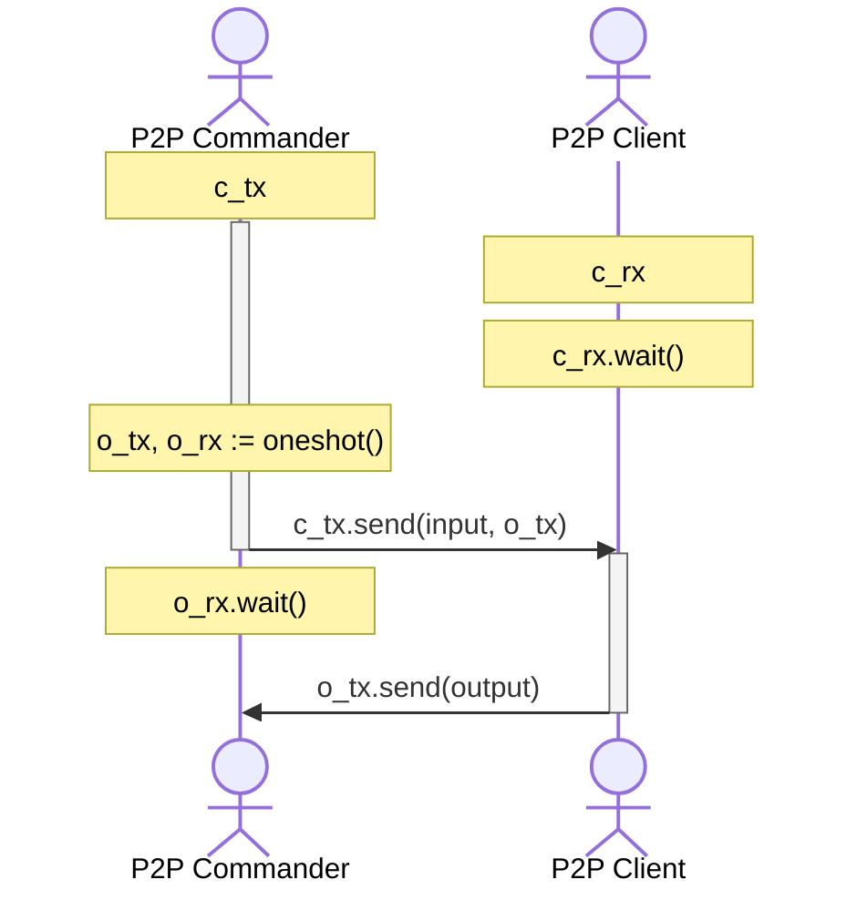

# DKN Peer-to-Peer Client

Dria Knowledge Network is a peer-to-peer network, built over libp2p. This crate is a wrapper client to easily interact with DKN.

## Installation

Add the package via `git` within your Cargo dependencies:

```toml
dkn-p2p = { git = "https://github.com/firstbatchxyz/dkn-compute-node" }
```

## Usage

The P2P client is expected to be run within a separate thread, and it has two types of interactions:

- **Events**: When a message is received within the Swarm event handler, it is returned via a `mpsc` channel. Here, the p2p is `Sender` and your application must be the `Receiver`. The client handles many events, and only sends GossipSub message receipts via this channel so that the application can handle them however they would like.



- **Commands**: To call functions within this thread-scoped client, functions must be remotely called via the command `mpsc` channel. Here, p2p is `Receiver` and your application will be the `Sender` (we provide the commander client as well). While making a function call, a `oneshot` channel is created and its `Sender` is provided to the commander, kind of like a callback, and the caller waits as the `Receiver` for this call.



<!--

FIXME: REMOVE COMMENTS

You can create the client as follows:

```rs
use dkn_p2p::DriaP2PClient;

// your wallet, or something random maybe
let keypair = Keypair::generate_secp256k1();

// your listen address
let addr = Multiaddr::from_str("/ip4/0.0.0.0/tcp/4001")?;

// static bootstrap & relay addresses
let bootstraps = vec![Multiaddr::from_str(
    "some-multiaddrs-here"
)?];
let relays = vec![Multiaddr::from_str(
    "some-multiaddrs-here"
)?];

// protocol version number, usually derived as `{major}.{minor}`
let version = "0.2";

// create the client!
let mut client = DriaP2PClient::new(keypair, addr, &bootstraps, &relays, "0.2")?;
```

Then, you can use its underlying functions, such as `subscribe`, `process_events` and `unsubscribe`. In particular, `process_events` handles all p2p events and returns a GossipSub message when it is received. -->
