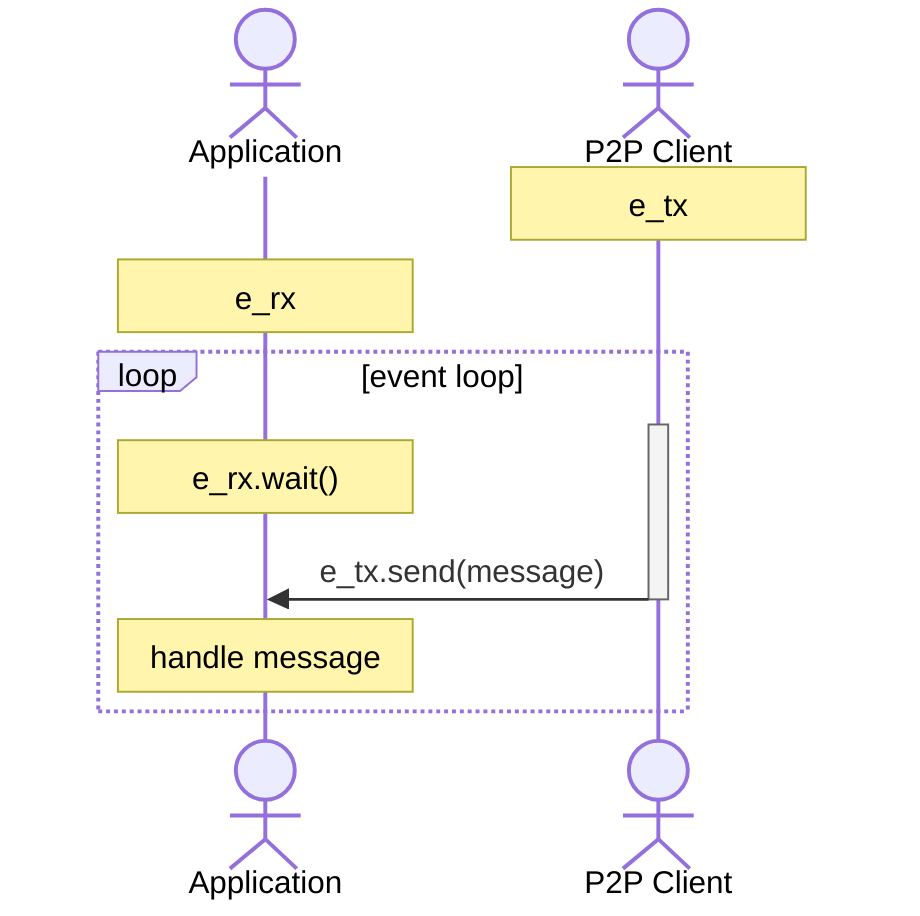
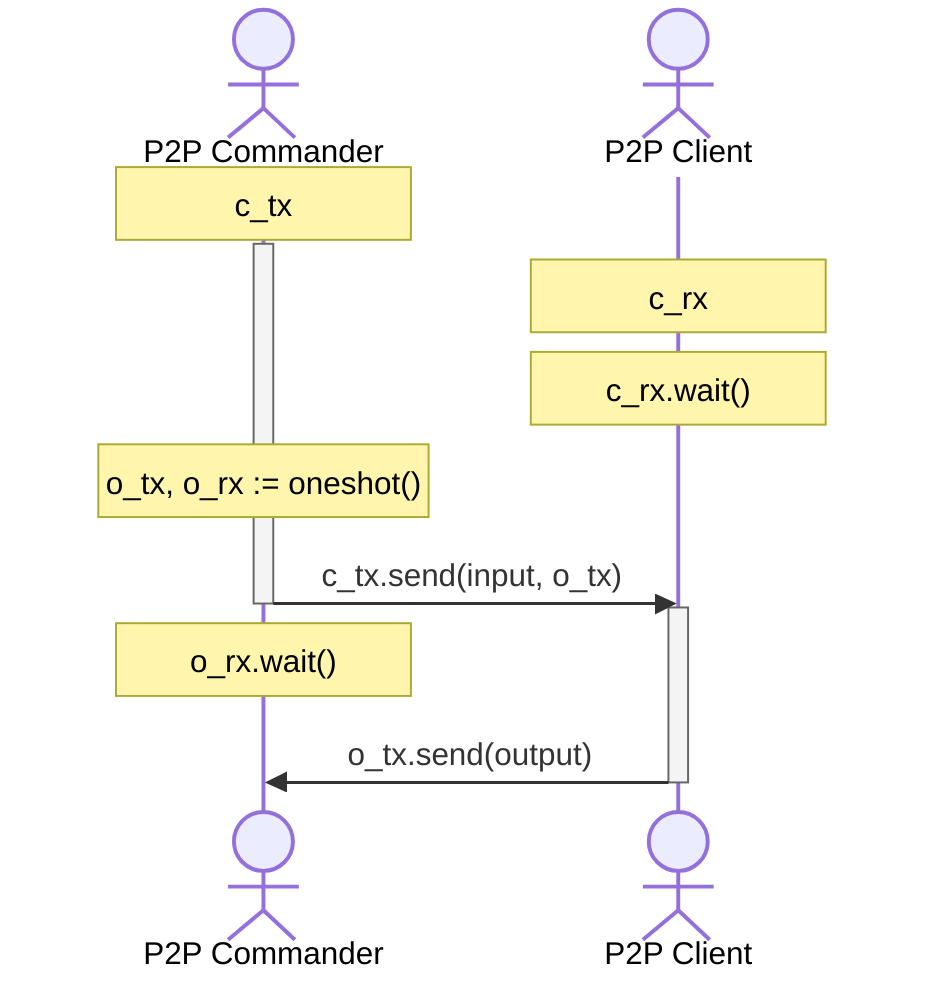

# Dria Peer-to-Peer Client

Dria Knowledge Network is a peer-to-peer network, built over libp2p. This crate is a wrapper client to easily interact with DKN.

## Installation

Add the package via `git` within your Cargo dependencies:

```toml
dkn-p2p = { git = "https://github.com/firstbatchxyz/dkn-compute-node" }
```

## Usage

The peer-to-peer client, when created, returns 3 things:

- `client`: the actual peer-to-peer client that should be run in a **separate thread**.
- `commander`: a small client that exposes peer-to-peer functions with oneshot channels, so that we can communicate with the client in another thread.
- `channel`: a message channel receiver, it is expected to handle GossipSub messages that are handled & sent by the client.

### Client

Here is an example where we create the said entities:

```rs
use dkn_p2p::{DriaP2PClient, DriaP2PProtocol};

// your wallet, or something random maybe
let keypair = Keypair::generate_secp256k1();

// your listen address
let addr = Multiaddr::from_str("/ip4/0.0.0.0/tcp/4001")?;

// static bootstrap & relay & rpc addresses
let bootstraps = vec![Multiaddr::from_str(
    "some-multiaddrs-here"
)?];
let relays = vec![Multiaddr::from_str(
    "some-multiaddrs-here"
)?];
let rpcs = vec![Multiaddr::from_str(
    "some-multiaddrs-here"
)?];

let protocol = "0.2";

// `new` returns 3 things:
// - p2p client itself, to be given to a thread
// - p2p commander, a small client to be able to speak with the p2p in another thread
// - `msg_rx`, the channel to listen for gossipsub messages
let (client, mut commander, mut msg_rx) = DriaP2PClient::new(
  keypair,
  addr,
  bootstraps,
  relays,
  rpc,
  protocol
)?;
```

Now, you can give the peer-to-peer client to a thread and store its handle:

```rs
let task_handle = tokio::spawn(async move { client.run().await });
```

This task handle should be `await`'ed at the end of the program to ensure thread has exited correctly.

### Commander

You can communicate with this thread using the `commander` entity. For example, here is how one would subscribe to a topic:

```rs
commander
  .subscribe("your-topic")
  .await
  .expect("could not subscribe");
```

### Channel

The message channel should be handled with `recv` (or `recv_many` to process in batches) to process the GossipSub messages.

```rs
loop {
    match msg_rx.recv().await {
        Some(msg) => {
            todo!("handle stuff")
        }
        None => {
            todo!("channel closed");
            break
        }
    }
}
```

### Interactions

Here is how the whole thing works in a bit more detail:

- **Events**: When a message is received within the Swarm event handler, it is returned via a `mpsc` channel. Here, the p2p is `Sender` and your application must be the `Receiver`. The client handles many events, and only sends GossipSub message receipts via this channel so that the application can handle them however they would like.



- **Commands**: To call functions within this thread-scoped client, functions must be remotely called via the command `mpsc` channel. Here, p2p is `Receiver` and your application will be the `Sender` (we provide the commander client as well). While making a function call, a `oneshot` channel is created and its `Sender` is provided to the commander, kind of like a callback, and the caller waits as the `Receiver` for this call.


